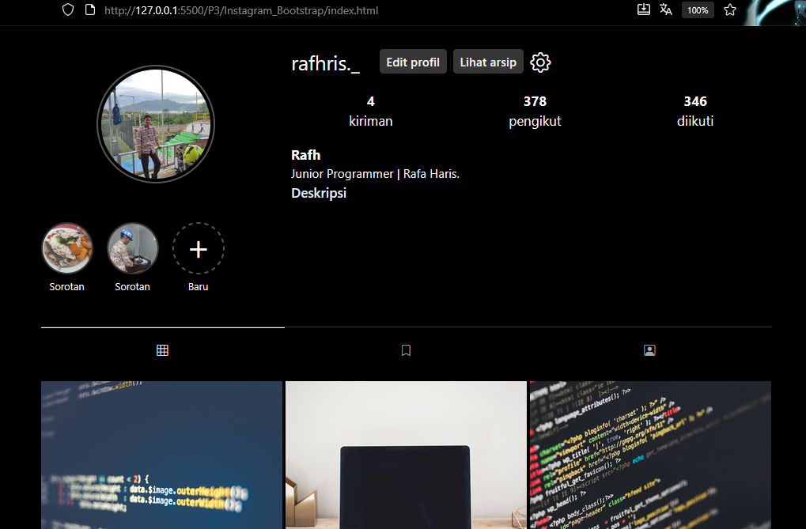

Tugas ini adalah cloning sederhana dari tampilan profile Instagram menggunakan **HTML**, **CSS** dan **Bootstrap 5.3**. Dibuat sebagai studi kasus untuk mempraktikkan keterampilan *front-end* dasar, khususnya dalam hal *layouting* yang responsif pada penggunaan Bootstrap.

---
## 🛠️ Dibangun Dengan

Proyek ini menggunakan teknologi web front-end standar:
* **HTML5**: Sebagai kerangka struktur halaman web.
* **CSS3**: Untuk memberikan gaya visual kustom seperti warna, ukuran font, dan detail lainnya yang tidak dicakup oleh Bootstrap.
* **Bootstrap 5**: Framework CSS utama yang digunakan untuk membuat tata letak (layout) yang responsif, komponen seperti grid, dan tombol.
* **Bootstrap Icons**: Untuk ikon-ikon yang digunakan di seluruh halaman, seperti ikon grid, bookmark, dan lainnya.

---
## ✨ Fitur Utama

* **Desain Responsif**: Tampilan secara otomatis menyesuaikan diri antara versi mobile dan desktop.
    * **Mobile**: Tata letak vertikal yang ringkas, dengan statistik dan bio di bawah foto profil.
    * **Desktop**: Tata letak horizontal yang lebih lebar, dengan foto profil di samping statistik dan bio.
* **Tema Gelap (Dark Mode)**: Skema warna gelap yang sesuai dengan antarmuka Instagram saat ini.
* **Komponen Profil**: Mencakup  elemen utama halaman profil:
    * Foto Profil
    * Statistik (Kiriman, Pengikut, Diikuti)
    * Bio Pengguna
    * Tombol "Edit Profil"
    * Story Highlights (Sorotan Cerita)
    * Tab Navigasi (Postingan, Disimpan, Ditandai)
    * Grid Postingan

---
## 🚀 Cara Menjalankan Proyek

Tutorial CLone, ikuti langkah-langkah sederhana berikut:
1.  **Pastikan Struktur Folder Benar**
    Pastikan Anda memiliki folder `img` di lokasi yang sama dengan file `index.html`. Semua file gambar Anda harus berada di dalam folder `img` tersebut.
    ```
    folder-proyek/
    ├── index.html
    └── img/
        ├── foto.png
        ├── saya.jpg
        └── (gambar-gambar lainnya...)
    ```
2.  **Buka File `index.html`**
    Cukup klik dua kali pada file `index.html` atau buka file tersebut menggunakan browser pilihan Anda (seperti Google Chrome, Firefox, dll). Bisa juga menggunakan VSCode Extensions bernama Live Server Halaman akan langsung ditampilkan.

---
## Apa itu Bootstrap? 🧰

Bootstrap adalah sebuah **framework** front-end populer berbasis HTML, CSS, dan JavaScript yang digunakan untuk membangun situs web dan aplikasi web yang responsif dan mobile-friendly dengan cepat dan efisien

**Keuntungan utama menggunakan Bootstrap adalah:**
1.  **Cepat**: Tidak perlu menulis banyak kode CSS dari awal.
2.  **Responsif**: Tampilan website otomatis menyesuaikan diri untuk layar HP, tablet, dan laptop (📱/💻).
3.  **Konsisten**: Desain terlihat seragam dan profesional di berbagai browser.

---
Penjelasan beberapa fungsi kode Bootstrap yang sering digunakan:

### Flexbox: `d-flex`, `justify-content-around`, `align-items-center`
```html
<div class="d-flex justify-content-around align-items-center">
    <div>...</div>
    <div>...</div>
    <div>...</div>
</div>
```
* `d-flex`: Singkatan dari "display: flex". Ini mengubah elemen menjadi sebuah *flex container*, yang membuat semua item di dalamnya **berbaris menyamping** (horizontal). Kode ini sangat sering digunakan untuk mengatur posisi.
* `justify-content-around`: Mengatur item di dalamnya agar memiliki **jarak spasi yang rata** di sekelilingnya. Ini kita gunakan pada bagian statistik (kiriman, pengikut, diikuti).
* `align-items-center`: Membuat semua item di dalamnya **rata tengah secara vertikal**.

### Sistem Grid: `container-fluid`, `row`, dan `col-`
```html
<div class="container-fluid">
    <div class="row">
        <div class="col-4">...</div>
        <div class="col-8">...</div>
    </div>
</div>
```

* `container-fluid`: Ini adalah "kanvas" utama yang membungkus seluruh konten Anda. `fluid` berarti lebarnya akan selalu 100% mengikuti lebar layar.
* `row`: Ini seperti membuat sebuah **baris** baru. Semua elemen di dalamnya akan dianggap sebagai bagian dari baris tersebut.
* `col-4` dan `col-8`: Ini adalah **kolom**. Bootstrap membagi setiap `row` menjadi 12 unit kolom.
    * `col-4` berarti "ambil 4 dari 12 unit kolom".
    * `col-8` berarti "ambil 8 dari 12 unit kolom".
    * Totalnya `4 + 8 = 12`, sehingga kedua kolom ini pas memenuhi satu `row`. Inilah dasar dari semua tata letak di Bootstrap.


### Utilitas Tampilan Responsif: `d-none` dan `d-md-block`

```html
<div class="d-none d-md-block">
    </div>
```

Ini adalah "sihir" di balik tampilan yang berbeda di HP dan laptop.
* `d-none`: Artinya "display: none". Elemen ini **disembunyikan** secara default di semua ukuran layar.
* `d-md-block`: Artinya "display: block pada ukuran layar medium ke atas". Perintah ini **mengalahkan** `d-none` ketika layar mencapai ukuran tablet atau laptop (`md` = medium), sehingga elemen tersebut **muncul kembali**.
* **Kombinasinya**: "Sembunyikan elemen ini, KECUALI jika layarnya seukuran laptop atau lebih besar."

### Komponen & Styling Cepat: `rounded-circle` dan `btn`

```html


<button class="btn btn-sm btn-custom">Edit profil</button>
```

* `rounded-circle`: Kelas ini secara instan mengubah gambar atau elemen kotak menjadi bentuk **lingkaran sempurna**. Sangat berguna untuk foto profil dan *highlights*.
* `btn`: Memberi gaya dasar sebuah tombol pada elemen.
* `btn-sm`: Membuat ukuran tombol menjadi lebih kecil (*small*).

# 📝 Instagram Profile Clone
