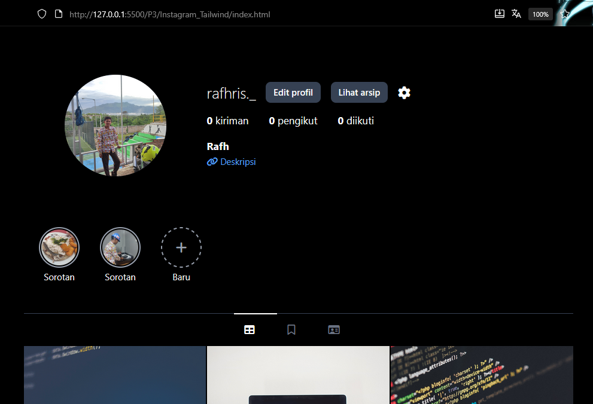

Tugas ini adalah cloning sederhana dari tampilan profile Instagram menggunakan **HTML** dan **Framework Tailwind 4.0**. Dibuat sebagai studi kasus untuk mempraktikkan keterampilan *front-end* dasar, khususnya dalam hal *layouting* yang responsif pada penggunaan Tailwind.

---
## 🛠️ Dibangun Dengan
- [HTML5](https://developer.mozilla.org/docs/Web/HTML)  
- [Tailwind CSS v4](https://tailwindcss.com/) (via CDN `@tailwindcss/browser`)  
- [Font Awesome 6](https://fontawesome.com/) (untuk ikon)  

---
## ✨ Fitur Utama
- **Header** mirip Instagram (logo username, ikon tambah, ikon menu)  
- **Foto profil** dengan lingkaran responsif (20x20 di HP, 40x40 di desktop)  
- **Statistik** (kiriman, pengikut, diikuti) tampil:
  - 📱 Mobile: di sebelah kanan foto profil  
  - 💻 Desktop: di bawah username  
- **Bio pengguna** dengan teks ringan + link aktif  
- **Highlight stories** dengan border lingkaran (solid & dashed)  
- **Navigasi tab** ala Instagram (grid, bookmark, id-card)  
- **Grid postingan** 3 kolom dengan `aspect-square`  

---
## 🚀 Cara Menjalankan Proyek

Tutorial CLone, ikuti langkah-langkah sederhana berikut:
1.  **Pastikan Struktur Folder Benar**
    Pastikan Anda memiliki folder `img` di lokasi yang sama dengan file `index.html`. Semua file gambar Anda harus berada di dalam folder `img` tersebut.
    ```
    folder-proyek/
    ├── index.html
    └── img/
        ├── foto.png
        ├── saya.jpg
        └── (gambar-gambar lainnya...)
    ```
2.  **Buka File `index.html`**
    Cukup klik dua kali pada file `index.html` atau buka file tersebut menggunakan browser pilihan Anda (seperti Google Chrome, Firefox, dll). Bisa juga menggunakan VSCode Extensions bernama Live Server Halaman akan langsung ditampilkan.

---
## Apa itu Tailwind? 🧰
Tailwind CSS adalah framework CSS utility-first, artinya kita menulis class langsung di HTML untuk styling.  

- `flex justify-between items-center p-4`  
  ➝ Membuat elemen **flexbox** dengan isi tersebar rata (justify-between), vertikal rata tengah (items-center), dan padding 1rem.

- `w-20 h-20 md:w-40 md:h-40 rounded-full`  
  ➝ Elemen berbentuk **lingkaran** dengan ukuran 80px (mobile) dan 160px (desktop).

- `hidden md:flex`  
  ➝ Elemen **disembunyikan** di mobile, tapi muncul sebagai flex di layar desktop.

- `grid grid-cols-3 gap-0.5`  
  ➝ Membuat **grid 3 kolom** dengan jarak antar elemen 2px.


# 📝 Instagram Profile Clone
